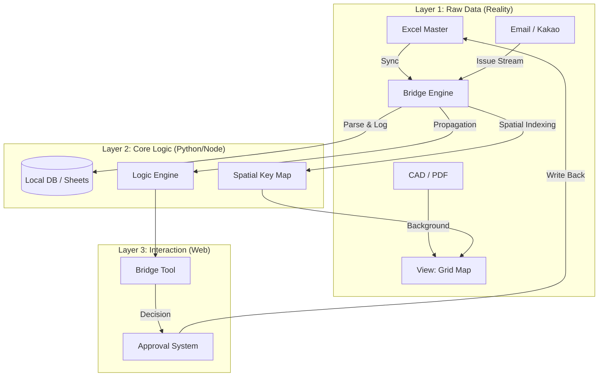

# P5 Bridge: Project Management Platform Design Document

**Version**: 1.0 (Draft)
**Target**: P5 Complex Building (PSRC + HMB)
**Philosophy**: Decision Support System (DSS) - "Bridge between Raw Data & Final Decision"

---

## 🏗️ 1. System Architecture

The platform operates as a **"Decision Support Layer"** over existing, dispersed data sources. It does *not* seek to replace Excel or CAD immediately but bridges them with logical control.

### 1.1 High-Level Architecture

### 1.2 User Flow (The bridge Loop)
1.  **Detect**: User uploads updated Excel or System detects critical Email/Kakao issue.
2.  **Visualize**: System maps the issue to the **Spatial Grid (View)**. Dots turn 'Red' or 'Yellow'.
3.  **Assess**: Engineer clicks the dot. **Bridge Tool** pops up showing connected Brackets/Beams.
4.  **Decide**: Engineer selects "Ignore", "Hold", or "Request Change".
5.  **Commit**: Decision is logged. If "Change", a Change Request is generated.
6.  **Apply**: approved changes Update the Master Data (Excel) or Status.

---

## 🧩 2. Data Model (MVP)

The **Spatial Key** is the absolute identifier: `[Type]_[Grid]_[Level]` (e.g., `PSRC_X1-Y1_3F`).

### 2.1 Core Tables

#### `GRID_MASTER` (The Spatial Index)
| Field | Type | Required | Source | Description |
|:---|:---|:---|:---|:---|
| **UID** | `String` (PK) | ✅ | Auto | `PSRC_X1-Y1_3F` |
| GRID_X | `String` | ✅ | CAD/Excel | X-axis Grid Line |
| GRID_Y | `String` | ✅ | CAD/Excel | Y-axis Grid Line |
| LEVEL | `String` | ✅ | CAD/Excel | Floor Level (e.g., 3F) |
| STATUS | `Enum` | ✅ | System | Current State (Ready/Shop/Fab...) |
| LAST_REV | `String` | ❌ | Excel | Latest Drawing Revision |

#### `HMB_4DIR` (Bracket Details)
| Field | Type | Required | Source | Description |
|:---|:---|:---|:---|:---|
| **UID** | `String` (FK) | ✅ | Auto | Parent Column UID |
| DIR | `Enum` | ✅ | Excel | N / E / S / W |
| STATUS | `Enum` | ✅ | System | Status of this specific bracket |
| CONN_TYPE | `String` | ❌ | Excel | Connection Detail Type |

#### `ISSUE_LOG` (The Trigger)
| Field | Type | Required | Source | Description |
|:---|:---|:---|:---|:---|
| **ISSUE_ID** | `Int` (PK) | ✅ | Auto | Auto-increment |
| TARGET_UID | `String` | ✅ | System | Linked Spatial Key |
| TYPE | `Enum` | ✅ | User/AI | `REV_MISMATCH`, `INTERFERENCE`, `HOLD` |
| SEVERITY | `Enum` | ✅ | AI/User | `CRITICAL`, `WARN`, `INFO` |
| SOURCE | `String` | ✅ | Connect | Gmail ID or Excel File Name |
| DESC | `Text` | ❌ | User | Human readable description |

#### `CHANGE_REQUEST` (The Gatekeeper)
| Field | Type | Required | Source | Description |
|:---|:---|:---|:---|:---|
| **REQ_ID** | `Int` (PK) | ✅ | Auto | Auto-increment |
| ISSUE_ID | `Int` (FK) | ✅ | System | Originating Issue |
| TARGET_UID | `String` | ✅ | System | Target Component |
| CURR_VAL | `Json` | ✅ | System | Snapshot before change |
| PROP_VAL | `Json` | ✅ | User | Proposed new value |
| APPROVER | `String` | ❌ | User | Person who approved |
| STATUS | `Enum` | ✅ | System | `PENDING`, `APPROVED`, `REJECTED` |

---

## 🔄 3. State Machine

Strict state transitions. **No AI auto-advancement.**

### 3.1 Lifecycle States
1.  **READY**: Initial design complete.
2.  **SHOP_DWG**: Shop drawing approved.
3.  **FAB**: Fabrication started/complete.
4.  **SHIP**: Shipped to site.
5.  **INSTALL**: Installed on site.

### 3.2 Special States
*   **HOLD**: Critical Stop. Can be applied at any stage.
*   **ISSUE**: Warning flag (does not stop workflow logic, but highlights visual).

### 3.3 Strict Rules
*   `SHIP` → `HOLD`: **Allowed**, but triggers "Protection Logic" (Alert: "Material is already on site!").
*   `FAB` → `SHOP_DWG` (Rollback): **Forbidden** without "Change Request (CR)".
*   `REV_MISMATCH`: Automatically sets purely visual status to `YELLOW` (Warning), does *not* change Lifecycle State.

---

## 🧠 4. Core Logic Specifications

### 4.1 Issue → Impact Calculation
When an issue is reported on `PSRC_X1-Y1_3F`:
1.  **Self Check**: Flag the column itself.
2.  **Bracket Check**: Query `HMB_4DIR` for this UID.
    *   If Issue Type is "Interference" (Geometric), flag **ALL 4 directions**.
    *   If Issue Type is "Rev Change" (Design), flag only affected directions if specified, else All.
3.  **Neighbor Check**: (Advanced) Find Beams connected to `HMB_4DIR`. If Beam is `PC`, flag the PC Beam UID as well.

### 4.2 Protection Logic (The Safety Net)
*   **Trigger**: User attempts to change status of a UID where `Current_State >= SHIP` or `Current_State >= FAB`.
*   **Action**:
    1.  Block immediate change.
    2.  Show **"Cost Impact Warning"**: "This element is already Fabricated. Modification may incur cost."
    3.  Require **"Force Approval"**: User must type a justification reason to proceed.

### 4.3 Dot Color Decision Tree
The *Visual Status* on the Grid Map is derived dynamically:

1.  **IF** `Status == HOLD` → ⚫ **BLACK** (Dead Stop)
2.  **ELSE IF** `Active_Issue_Count > 0` AND `Severity == CRITICAL` → 🔴 **RED**
3.  **ELSE IF** `Rev_Mismatch == TRUE` → 🟡 **YELLOW**
4.  **ELSE IF** `Status == INSTALL` → 🟢 **GREEN** (Completed)
5.  **ELSE** → ⚪ **GREY / WHITE** (Normal)

---

## 🖥️ 5. UI/UX Specifications

### 5.1 Main Grid Map (The View)
*   **Background**: SVG output of the CAD Floor Plan (Grade lines, Walls). dimmed to 30% opacity.
*   **Interactive Layer**:
    *   **Columns**: Represented as Circle Dots.
    *   **Colors**: Based on Decision Tree (Red/Yellow/Green/Black).
    *   **Interactions**:
        *   *Hover*: Show UID + Current Status.
        *   *Click*: Open **Bridge Tool**.

### 5.2 Bridge Tool (Right Sidebar / Drawer)
*   **Header**: UID (`PSRC_X1-Y1_3F`) + Current Status Badge.
*   **HMB Quadrant View**:
    *   Visual "Cross" (+) representing N/E/S/W brackets.
    *   Each arm colored by its specific status.
*   **Issue List**:
    *   Cards showing linked Issues (from Email/Excel).
    *   "View Source" button (opens Email or highlights Excel row).
*   **Action Panel**:
    *   [ Hold ] [ Release ] [ Create CR ]
    *   *Decision Log*: History of who clicked what for this element.

---

## 🛠️ 6. Tech Stack Proposal

### Reality-First Selection
*   **Frontend**: **React** (Vite) + **Konva.js** (Canvas 2D).
    *   *Why*: Konva handles thousands of dots (PSRC columns) better than DOM nodes. Simple interactions.
    *   *State*: Zustand (Simple store).
*   **Backend**: **FastAPI** (Python).
    *   *Why*: Best library ecosystem for **Pandas** (Excel manipulation) and **epp-python** (potentially for CAD parsing).
    *   *API*: REST. Simple endpoints.
*   **Database**: **SQLite** (Local file) or **Google Sheets** (as DB).
    *   *Recommendation*: **SQLite** for the "Platform State" (Logs, CRs) to ensure integrity. **Excel/Google Sheets** remains the "Master Input" synchronization source.
*   **Auth**: Simple Password (Project Level). No complex OAuth needed for MVP.

---

## 📅 7. Build Roadmap (WBS)

### Phase 0: Data Normalization (Week 1-2)
*   [ ] Define "Excel Import Template" (Standard Header mapping).
*   [ ] Build "Spatial Key Generator" script (Excel -> UID).
*   [ ] Clean existing Excel data to ensure Grid/Level consistency.

### Phase 1: Visualization MVP (Week 3-4)
*   [ ] Setup React + Konva.
*   [ ] Implement "Grid Map" rendering from XY coordinates.
*   [ ] Connect "Excel Sync" (Read-only) to color the dots.
*   **Goal**: Replace "paper markup" with this screen.

### Phase 2: Bridge Tool & Logic (Week 5-6)
*   [ ] Implement `ISSUE_LOG` and `CHANGE_REQUEST` tables (SQLite).
*   [ ] Build the "Bridge Drawer" UI.
*   [ ] Implement "Protection Logic" (Warning on FAB/SHIP status).
*   **Goal**: Start tracking issues digitally.

### Phase 3: Email/Kakao Integration (Week 7+)
*   [ ] Connect existing "Email -> Sheet" automation as an input source for `ISSUE_LOG`.
*   [ ] Implement "Rev Mismatch" detection (Auto-compare Excel vs CAD index).
