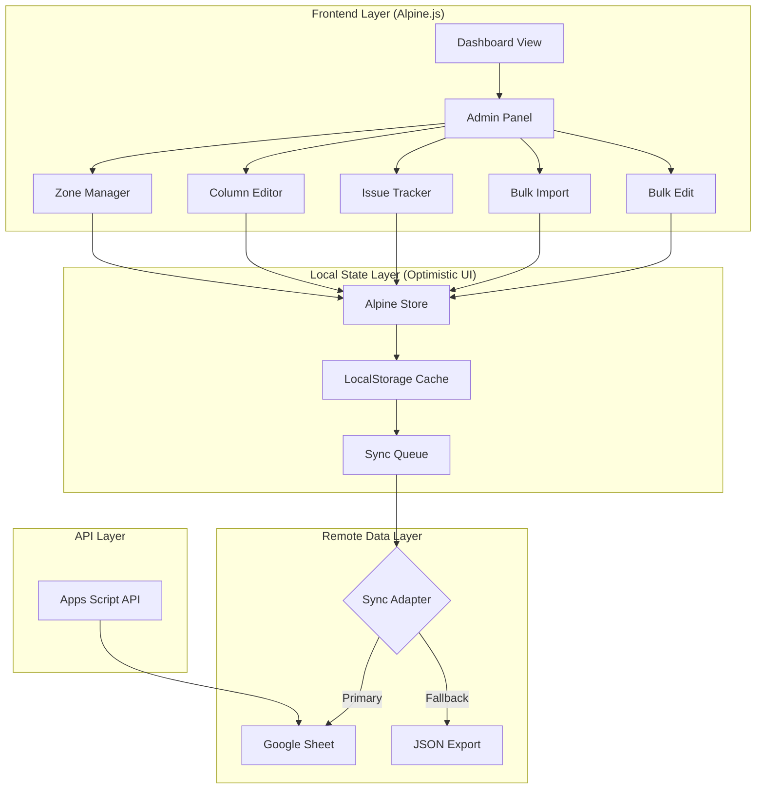
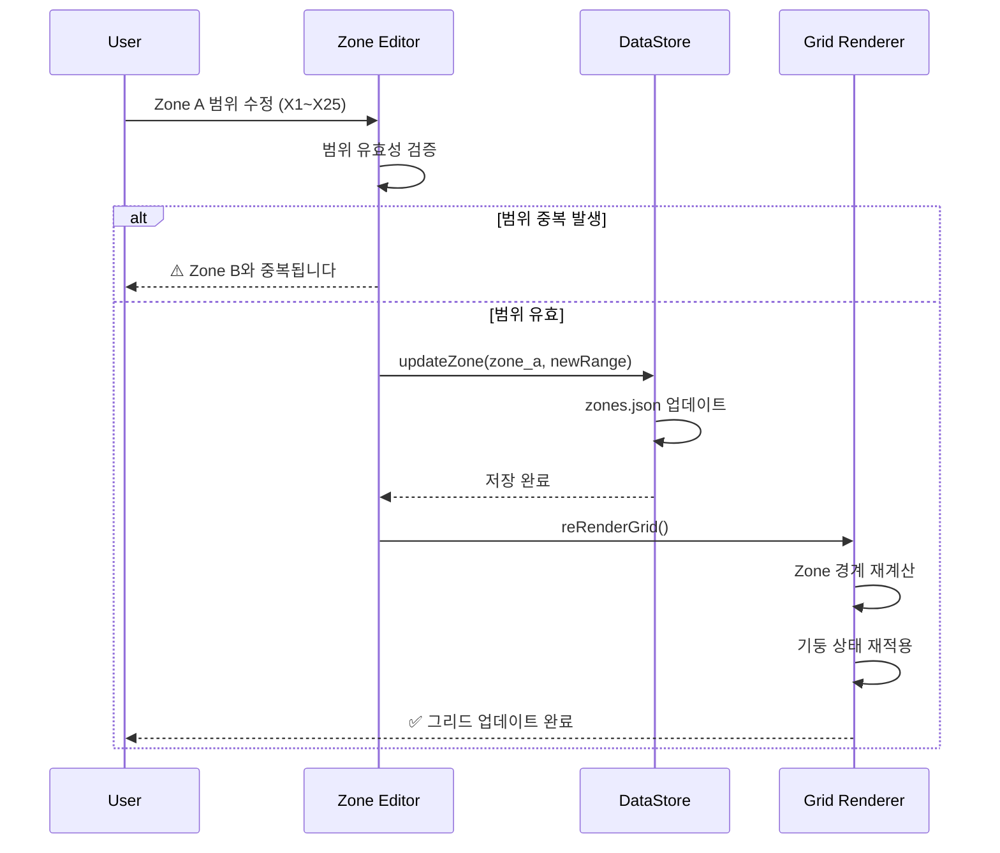
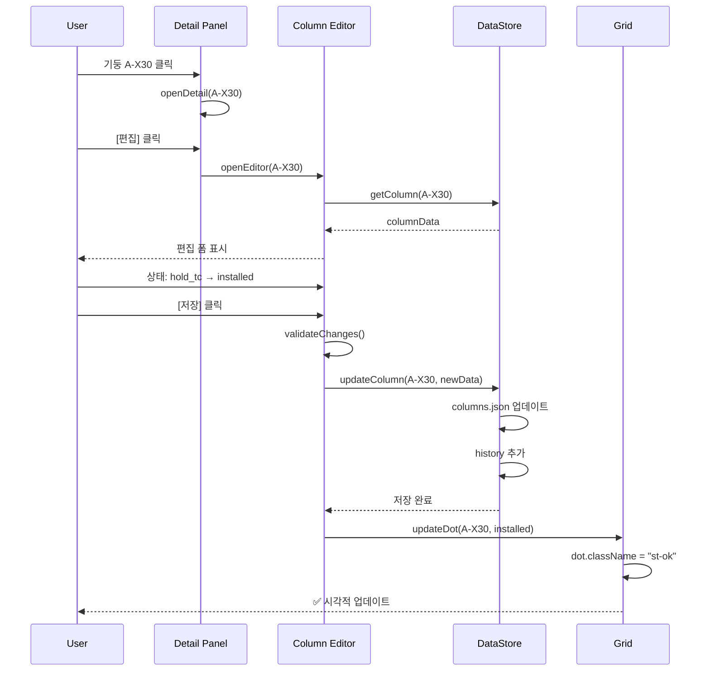
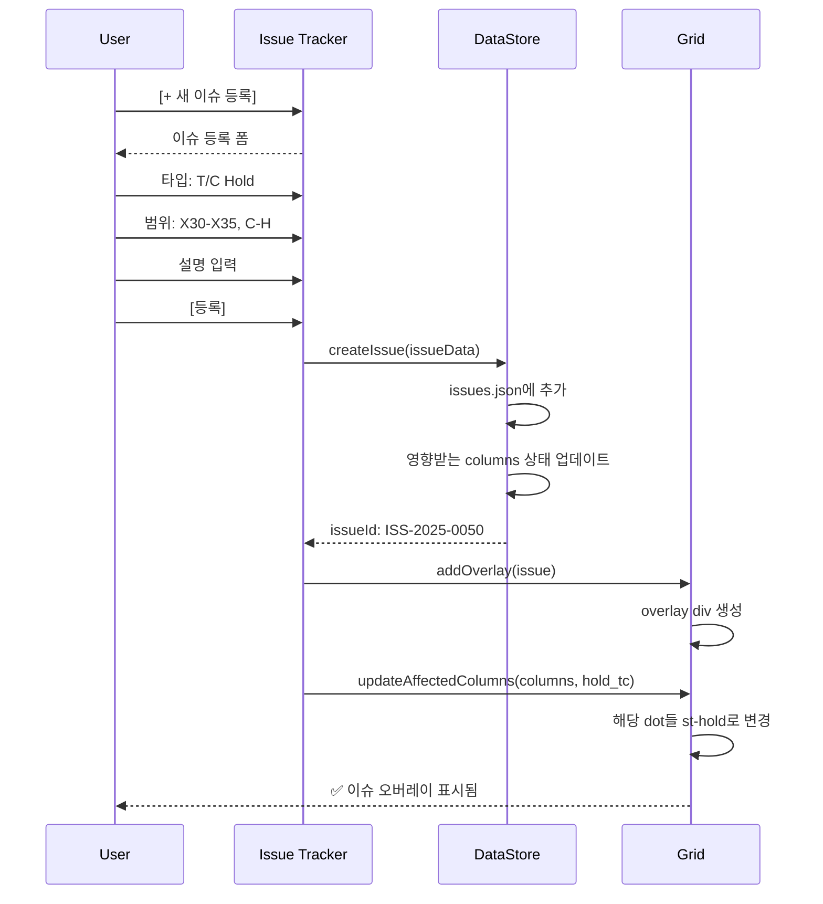

# P5 복합동 - 정보 입력 및 관리 모듈 설계서

**Version**: 2.0  
**Date**: 2025-12-29  
**Status**: ✅ 승인 완료

---

## 📋 개요

본 문서는 P5 Live Grid Dashboard에 **사용자 관리 기능**을 추가하기 위한 설계서입니다. 현재 하드코딩된 Zone 구분 및 기둥 상태를 사용자가 직접 설정/수정할 수 있는 관리 모듈을 정의합니다.

### 목표
1. **Zone 설정 관리** - 사용자가 Zone 범위, 이름, 색상 정의
2. **기둥 정보 관리** - 개별 기둥 상태/이슈/담당자 수정
3. **이슈 관리** - T/C 간섭, 설계 변경 등 이슈 등록/해제
4. **데이터 영속성** - Google Sheet 또는 LocalStorage 연동
5. **권한 관리** - 조회자/편집자/관리자 역할 분리

---

## 🏗️ 1. 시스템 아키텍처

> [!IMPORTANT]
> **승인된 설계 원칙 (2025-12-29)**
> 1. **Alpine.js** 경량 프레임워크 도입
> 2. **Hybrid Sync** (로컬 선반영 + 백그라운드 동기화)
> 3. **Master-Override Lock** (AI 덮어쓰기 방지)
> 4. **Bulk Edit** (다중 선택 편집) Phase 1 핵심 기능

### 1.1 전체 구조 (Approved)



### 1.2 모듈 구성

| 모듈 | 기능 | 우선순위 |
|------|------|----------|
| **Zone Manager** | Zone 생성/수정/삭제, 범위 설정 | 🔴 High |
| **Column Editor** | 개별 기둥 상태 변경, 메타데이터 수정 | 🔴 High |
| **Issue Tracker** | 이슈 등록/해제, 오버레이 관리 | 🟡 Medium |
| **Bulk Import** | Excel/CSV 일괄 업로드 | 🟡 Medium |
| **User Settings** | 색상 테마, 알림 설정 | 🟢 Low |
| **Activity Log** | 변경 이력 조회 | 🟢 Low |

---

## 📐 2. 데이터 모델 설계

### 2.1 Zone Configuration

```javascript
// zones.json 또는 Sheet "Zones" 탭
const ZoneSchema = {
    id: "zone_a",                    // 고유 ID
    name: "ZONE A",                  // 표시 이름
    displayName: "FAB",              // 약칭
    description: "Utility Support",  // 설명
    
    // 범위 정의
    range: {
        startColumn: 1,              // X1부터
        endColumn: 23,               // X23까지
        startRow: 0,                 // A(0)부터
        endRow: 11                   // L(11)까지
    },
    
    // 시각화 설정
    style: {
        primaryColor: "#238636",     // 메인 컬러
        backgroundColor: "rgba(35, 134, 54, 0.1)",
        progressPercent: 92          // 진행률
    },
    
    // 메타데이터
    metadata: {
        createdAt: "2025-12-01",
        updatedAt: "2025-12-29",
        createdBy: "admin"
    }
};
```

### 2.2 Column Data

```javascript
// columns.json 또는 Sheet "Columns" 탭
const ColumnSchema = {
    uid: "A-X1",                     // 고유 ID (Row-Column)
    
    // 위치 정보
    location: {
        row: "A",                    // Y축 라벨
        rowIndex: 0,                 // Y축 인덱스
        column: 1,                   // X축 번호
        zoneId: "zone_a"             // 소속 Zone
    },
    
    // 상태 정보 (Master-Override Lock 포함)
    status: {
        code: "installed",           // installed | active | hold | design | pending
        label: "설치 완료",
        color: "#238636",
        updatedAt: "2025-12-28T14:30:00",
        source: "admin",             // ✅ NEW: "ai" | "admin" (변경 출처)
        isLocked: true               // ✅ NEW: true면 AI가 덮어쓰지 않음
    },
    
    // 이슈 정보 (nullable)
    issue: {
        type: null,                  // null | "tc" | "design" | "material" | "safety"
        title: null,
        description: null,
        severity: null,              // critical | high | medium | low
        reportedBy: null,
        reportedAt: null,
        resolvedAt: null
    },
    
    // 부재 정보
    member: {
        type: "SRC Column",          // SRC Column | Steel Beam | PC Girder
        section: "H-500x500",        // 단면 규격
        material: "SM490",           // 재질
        weight: 2500                 // kg
    },
    
    // 공정 정보
    schedule: {
        plannedStart: "2025-11-01",
        plannedEnd: "2025-11-15",
        actualStart: "2025-11-03",
        actualEnd: "2025-11-14"
    },
    
    // 담당 정보
    assignment: {
        contractor: "삼성E&A",
        supervisor: "홍길동",
        contact: "010-1234-5678"
    },
    
    // 문서 연결
    documents: {
        shopDrawingId: "SD-2025-001",
        shopDrawingRev: "Rev.D",
        bimModelId: "BIM-COL-A-X1"
    },
    
    // 변경 이력
    history: [
        {
            timestamp: "2025-12-28T14:30:00",
            action: "status_change",
            from: "active",
            to: "installed",
            user: "site_manager"
        }
    ]
};
```

### 2.3 Issue Template

```javascript
// issues.json 또는 Sheet "Issues" 탭
const IssueSchema = {
    id: "ISS-2025-0042",
    type: "tc",                      // tc | design | material | safety | quality
    title: "T/C #5 간섭",
    
    // 영향 범위
    affectedArea: {
        columns: ["C-X30", "C-X31", "C-X32", "D-X30", "D-X31", "D-X32"],
        zoneId: "zone_b",
        // 또는 범위로 정의
        range: {
            startColumn: 30,
            endColumn: 35,
            startRow: 2,
            endRow: 7
        }
    },
    
    // 오버레이 표시 설정
    overlay: {
        show: true,
        label: "⛔ T/C #5\nInterference",
        borderColor: "#da3633",
        backgroundColor: "rgba(218,54,51,0.1)"
    },
    
    // 상세 정보
    detail: {
        description: "타워크레인 #5 해체 전까지 작업 불가",
        severity: "critical",
        expectedResolution: "2025-11-15",
        actualResolution: null,
        rootCause: "T/C 작업반경 내 기둥 위치",
        mitigationPlan: "X40 라인 우선 시공 후 복귀"
    },
    
    // 이력
    status: "open",                  // open | in_progress | resolved | closed
    reportedBy: "site_manager",
    reportedAt: "2025-12-20T09:00:00",
    assignedTo: "structural_eng",
    
    // 코멘트
    comments: [
        {
            user: "System",
            message: "Auto-detected T/C conflict.",
            timestamp: "2025-12-20T09:00:00",
            isSystem: true
        },
        {
            user: "Site Manager",
            message: "X40 라인 우선 진행 요청",
            timestamp: "2025-12-20T10:30:00",
            isSystem: false
        }
    ]
};
```

### 2.4 Status Code 정의

```javascript
// status_codes.json
const StatusCodes = {
    // 기본 상태
    "pending": {
        label: "대기",
        color: "#484f58",
        shape: "circle",
        opacity: 0.5
    },
    "active": {
        label: "진행중",
        color: "#1f6feb",
        shape: "circle",
        opacity: 1.0
    },
    "installed": {
        label: "설치완료",
        color: "#238636",
        shape: "circle",
        opacity: 1.0
    },
    
    // 이슈 상태
    "hold_tc": {
        label: "T/C Hold",
        color: "#da3633",
        shape: "square",        // 사각형으로 구분
        opacity: 1.0
    },
    "hold_design": {
        label: "설계 변경",
        color: "#d29922",
        shape: "circle",
        borderWidth: 2,         // 테두리 강조
        opacity: 1.0
    },
    "hold_material": {
        label: "자재 대기",
        color: "#8957e5",
        shape: "circle",
        opacity: 1.0
    },
    "hold_safety": {
        label: "안전 점검",
        color: "#f85149",
        shape: "triangle",      // 삼각형 경고
        opacity: 1.0
    }
};
```

---

## 🎨 3. UI 컴포넌트 설계

### 3.1 Admin Panel (메인 관리 패널)

```
┌─────────────────────────────────────────────────────────────┐
│ ⚙️ P5 관리자 패널                                    [✕]   │
├─────────────────────────────────────────────────────────────┤
│ ┌─────────┬─────────┬─────────┬─────────┬─────────┐        │
│ │  Zone   │ Column  │  Issue  │  Import │ Settings│        │
│ │ Manager │ Editor  │ Tracker │  Data   │         │        │
│ └─────────┴─────────┴─────────┴─────────┴─────────┘        │
│                                                             │
│  [Content Area - Changes based on selected tab]            │
│                                                             │
└─────────────────────────────────────────────────────────────┘
```

### 3.2 Zone Manager UI

```
┌─────────────────────────────────────────────────────────────┐
│ 🗂️ Zone 관리                              [+ 새 Zone 추가] │
├─────────────────────────────────────────────────────────────┤
│                                                             │
│ ┌─────────────────────────────────────────────────────────┐ │
│ │ ZONE A: FAB                                    [편집] [삭제] │
│ │ ───────────────────────────────────────────────────────── │
│ │ 범위: X1 ~ X23 (23개 컬럼)                                │
│ │ 진행률: ████████████████████░░ 92%                       │
│ │ 색상: 🟢 #238636                                          │
│ └─────────────────────────────────────────────────────────┘ │
│                                                             │
│ ┌─────────────────────────────────────────────────────────┐ │
│ │ ZONE B: CUB                                    [편집] [삭제] │
│ │ ───────────────────────────────────────────────────────── │
│ │ 범위: X24 ~ X45 (22개 컬럼)                               │
│ │ 진행률: █████████░░░░░░░░░░░░ 45%                        │
│ │ 색상: 🔵 #1f6feb                                          │
│ │ ⚠️ T/C 간섭 영역 포함                                    │
│ └─────────────────────────────────────────────────────────┘ │
│                                                             │
└─────────────────────────────────────────────────────────────┘
```

### 3.3 Zone 편집 Modal

```
┌─────────────────────────────────────────────────────────────┐
│ Zone 설정 편집                                       [✕]   │
├─────────────────────────────────────────────────────────────┤
│                                                             │
│ Zone ID          [zone_a        ] (읽기 전용)               │
│                                                             │
│ Zone 이름        [ZONE A        ]                           │
│                                                             │
│ 표시 이름        [FAB           ]                           │
│                                                             │
│ 설명             [Utility Support                        ]  │
│                                                             │
│ ─────────────────────────────────────────────────────────── │
│ 범위 설정                                                   │
│                                                             │
│ 시작 컬럼 (X)    [  1 ] ▼        끝 컬럼 (X)    [ 23 ] ▼   │
│                                                             │
│ 시작 행 (Y)      [  A ] ▼        끝 행 (Y)      [  L ] ▼   │
│                                                             │
│ ─────────────────────────────────────────────────────────── │
│ 시각화 설정                                                 │
│                                                             │
│ 메인 컬러        [🎨 #238636    ] [색상 선택기]             │
│                                                             │
│ 진행률 (%)       [ 92 ] ▼  또는  [✓] 자동 계산             │
│                                                             │
│ ─────────────────────────────────────────────────────────── │
│                                                             │
│                              [취소]  [💾 저장]              │
│                                                             │
└─────────────────────────────────────────────────────────────┘
```

### 3.4 Column Editor (개별 기둥 편집)

```
┌─────────────────────────────────────────────────────────────┐
│ 📍 기둥 상세 편집: A - X30                           [✕]   │
├─────────────────────────────────────────────────────────────┤
│                                                             │
│ ┌─[기본 정보]──────────────────────────────────────────────┐ │
│ │ 위치: Zone B (CUB) | Row A | Column X30                 │ │
│ │ 부재 타입: [SRC Column      ] ▼                         │ │
│ │ 단면 규격: [H-500x500       ]                           │ │
│ │ 재질:      [SM490           ] ▼                         │ │
│ └──────────────────────────────────────────────────────────┘ │
│                                                             │
│ ┌─[상태 관리]──────────────────────────────────────────────┐ │
│ │                                                          │ │
│ │ 현재 상태: [● T/C Hold      ] ▼                         │ │
│ │                                                          │ │
│ │ ○ 대기 (Pending)                                        │ │
│ │ ○ 진행중 (Active)                                       │ │
│ │ ○ 설치완료 (Installed)                                  │ │
│ │ ─────────────────────────────────                       │ │
│ │ ● T/C Hold (Blocked)         ← 현재                     │ │
│ │ ○ 설계 변경 (Design Hold)                               │ │
│ │ ○ 자재 대기 (Material Hold)                             │ │
│ │                                                          │ │
│ └──────────────────────────────────────────────────────────┘ │
│                                                             │
│ ┌─[이슈 연결]──────────────────────────────────────────────┐ │
│ │ 연결된 이슈: ISS-2025-0042 (T/C #5 간섭)        [해제]  │ │
│ │ 또는: [새 이슈 등록]  [기존 이슈 연결]                  │ │
│ └──────────────────────────────────────────────────────────┘ │
│                                                             │
│ ┌─[공정 정보]──────────────────────────────────────────────┐ │
│ │ 계획 시작: [2025-11-01] 📅    계획 종료: [2025-11-15] 📅│ │
│ │ 실제 시작: [2025-11-03] 📅    실제 종료: [          ] 📅│ │
│ └──────────────────────────────────────────────────────────┘ │
│                                                             │
│ ┌─[담당 정보]──────────────────────────────────────────────┐ │
│ │ 시공사:   [삼성E&A          ]                           │ │
│ │ 담당자:   [홍길동            ]                           │ │
│ │ 연락처:   [010-1234-5678     ]                           │ │
│ └──────────────────────────────────────────────────────────┘ │
│                                                             │
│                              [취소]  [💾 저장]              │
│                                                             │
└─────────────────────────────────────────────────────────────┘
```

### 3.5 Issue Tracker

```
┌─────────────────────────────────────────────────────────────┐
│ 🚨 이슈 관리                               [+ 새 이슈 등록] │
├─────────────────────────────────────────────────────────────┤
│ 필터: [전체 ▼] [Zone B ▼] [열린 이슈만 ☑]      🔍 검색    │
├─────────────────────────────────────────────────────────────┤
│                                                             │
│ ┌─[ISS-2025-0042]─────────────────────────────────────────┐ │
│ │ 🔴 CRITICAL | T/C #5 간섭                      [열림]   │ │
│ │ ─────────────────────────────────────────────────────── │ │
│ │ 영향 범위: X30~X35, Row C~H (36 columns)                │ │
│ │ 등록일: 2025-12-20 | 담당: structural_eng               │ │
│ │ 예상 해결: 2025-11-15                                   │ │
│ │                                                         │ │
│ │ [상세보기] [편집] [해결 처리]                           │ │
│ └─────────────────────────────────────────────────────────┘ │
│                                                             │
│ ┌─[ISS-2025-0045]─────────────────────────────────────────┐ │
│ │ 🟡 HIGH | Rev.D 설계 변경 (Mega Truss)         [열림]   │ │
│ │ ─────────────────────────────────────────────────────── │ │
│ │ 영향 범위: X55~X60, Row E~H (24 columns)                │ │
│ │ 등록일: 2025-12-22 | 담당: design_team                  │ │
│ │ 예상 해결: 2025-12-30                                   │ │
│ │                                                         │ │
│ │ [상세보기] [편집] [해결 처리]                           │ │
│ └─────────────────────────────────────────────────────────┘ │
│                                                             │
└─────────────────────────────────────────────────────────────┘
```

### 3.6 Bulk Import UI

```
┌─────────────────────────────────────────────────────────────┐
│ 📤 데이터 일괄 가져오기                              [✕]   │
├─────────────────────────────────────────────────────────────┤
│                                                             │
│ 데이터 유형 선택:                                           │
│ ┌───────────┐ ┌───────────┐ ┌───────────┐ ┌───────────┐    │
│ │ ○ Zone    │ │ ● Column  │ │ ○ Issue   │ │ ○ Status  │    │
│ │   설정    │ │   정보    │ │   목록    │ │   코드    │    │
│ └───────────┘ └───────────┘ └───────────┘ └───────────┘    │
│                                                             │
│ ─────────────────────────────────────────────────────────── │
│                                                             │
│ ┌───────────────────────────────────────────────────────┐  │
│ │                                                       │  │
│ │     📁 파일을 여기로 드래그하거나 클릭하여 선택      │  │
│ │                                                       │  │
│ │     지원 형식: .xlsx, .csv, .json                    │  │
│ │                                                       │  │
│ └───────────────────────────────────────────────────────┘  │
│                                                             │
│ [📥 템플릿 다운로드 (Excel)]                               │
│                                                             │
│ ─────────────────────────────────────────────────────────── │
│ 또는 Google Sheet 연결:                                     │
│                                                             │
│ Sheet URL: [https://docs.google.com/spreadsheets/d/... ]   │
│ 시트 이름: [Columns         ] ▼                            │
│                                                             │
│ [🔗 연결 테스트]                                            │
│                                                             │
│ ─────────────────────────────────────────────────────────── │
│                                                             │
│                              [취소]  [📤 가져오기]          │
│                                                             │
└─────────────────────────────────────────────────────────────┘
```

---

## 🔄 4. 데이터 흐름

### 4.1 Zone 수정 흐름



### 4.2 기둥 상태 변경 흐름



### 4.3 이슈 등록 흐름



---

## 💾 5. 저장소 옵션

### 5.1 Option A: Google Sheet (권장)

```javascript
// Apps Script Web App으로 CRUD API 제공
const SHEET_CONFIG = {
    spreadsheetId: 'YOUR_SHEET_ID',
    sheets: {
        zones: 'Zones',
        columns: 'Columns', 
        issues: 'Issues',
        statusCodes: 'StatusCodes',
        history: 'History'
    }
};

// API Endpoints (doGet, doPost)
// GET  ?action=getZones
// GET  ?action=getColumns&zone=zone_a
// POST ?action=updateColumn  {uid, data}
// POST ?action=createIssue   {issueData}
```

**장점:**
- Gmail-Gemini 시스템과 동일 플랫폼
- 사용자 친숙한 인터페이스
- 무료, 추가 인프라 불필요
- 협업 기능 내장

**단점:**
- API 호출 제한 (6분 실행 시간)
- 대용량 데이터 성능 저하
- 복잡한 쿼리 어려움

### 5.2 Option B: LocalStorage + Export

```javascript
// 브라우저 로컬 저장
const LocalStorage = {
    save: (key, data) => {
        localStorage.setItem(`p5_${key}`, JSON.stringify(data));
    },
    load: (key) => {
        return JSON.parse(localStorage.getItem(`p5_${key}`) || '{}');
    },
    export: () => {
        // 전체 데이터 JSON 파일로 다운로드
        const data = {
            zones: LocalStorage.load('zones'),
            columns: LocalStorage.load('columns'),
            issues: LocalStorage.load('issues')
        };
        downloadJSON('p5_backup.json', data);
    },
    import: (file) => {
        // JSON 파일 업로드하여 복원
    }
};
```

**장점:**
- 오프라인 사용 가능
- 즉시 응답 (로컬)
- 서버 불필요

**단점:**
- 브라우저/기기 종속
- 공유 어려움
- 데이터 유실 위험

### 5.3 Option C: Firebase/Supabase (확장용)

```javascript
// Supabase 예시
const supabase = createClient(SUPABASE_URL, SUPABASE_KEY);

// Realtime 구독
supabase
    .channel('columns')
    .on('postgres_changes', { event: '*', schema: 'public', table: 'columns' }, 
        (payload) => {
            // 실시간 그리드 업데이트
            updateGridFromPayload(payload);
        }
    )
    .subscribe();
```

**장점:**
- 실시간 동기화
- 확장성
- 강력한 쿼리 기능

**단점:**
- 추가 비용
- 설정 복잡도
- 외부 의존성

---

## 🔐 6. 권한 관리

### 6.1 역할 정의

| 역할 | 그리드 조회 | 상태 변경 | Zone 관리 | 이슈 관리 | 시스템 설정 |
|------|-------------|-----------|-----------|-----------|-------------|
| **Viewer** | ✅ | ❌ | ❌ | ❌ | ❌ |
| **Editor** | ✅ | ✅ | ❌ | ✅ | ❌ |
| **Manager** | ✅ | ✅ | ✅ | ✅ | ❌ |
| **Admin** | ✅ | ✅ | ✅ | ✅ | ✅ |

### 6.2 구현 방안

```javascript
// 간단한 역할 기반 접근 제어
const UserRoles = {
    VIEWER: 'viewer',
    EDITOR: 'editor', 
    MANAGER: 'manager',
    ADMIN: 'admin'
};

const Permissions = {
    VIEW_GRID: [UserRoles.VIEWER, UserRoles.EDITOR, UserRoles.MANAGER, UserRoles.ADMIN],
    EDIT_COLUMN: [UserRoles.EDITOR, UserRoles.MANAGER, UserRoles.ADMIN],
    MANAGE_ZONE: [UserRoles.MANAGER, UserRoles.ADMIN],
    MANAGE_ISSUE: [UserRoles.EDITOR, UserRoles.MANAGER, UserRoles.ADMIN],
    SYSTEM_SETTINGS: [UserRoles.ADMIN]
};

function hasPermission(userRole, permission) {
    return Permissions[permission]?.includes(userRole) || false;
}
```

---

## 📋 7. 구현 우선순위 (수정된 로드맵)

> [!NOTE]
> 리스크 분석 결과를 반영하여 로드맵이 재조정되었습니다.

### Phase 1: Dashboard Core & Local Mode (1주) ✅ 승인됨
- [ ] **Alpine.js 프레임워크** 설정
- [ ] JSON 데이터 모델 구현
- [ ] LocalStorage CRUD 레이어
- [ ] **Bulk Edit (다중 선택)** 구현
- [ ] Zone Manager UI + CRUD
- [ ] Column Editor (상태 변경)

### Phase 2: Sheet Sync Adapter (1주)
- [ ] Apps Script `doGet`/`doPost` API 구축
- [ ] **Hybrid Sync (Optimistic UI)** 구현
- [ ] 충돌 감지 (Timestamp 체크)

### Phase 3: AI & Issue Integration (1주)
- [ ] Issue Tracker UI
- [ ] AI 분석 결과 오버레이
- [ ] **Master-Override Lock** 로직
- [ ] 이슈 시각화 (T/C, Design)

### Phase 4: Admin Tools & Optimization (1주)
- [ ] Zone/Master Data 설정 UI
- [ ] CSV/Excel 대량 업로드
- [ ] 모바일 뷰 최적화
- [ ] 변경 이력 조회

---

## 📝 요약

| 항목 | 내용 |
|------|------|
| **핵심 모듈** | Zone Manager, Column Editor, Issue Tracker, Bulk Import |
| **데이터 저장소** | Google Sheet 권장 (Gmail 시스템과 통합) |
| **권한 체계** | Viewer → Editor → Manager → Admin |
| **예상 개발 기간** | 4주 (Phase 1~4) |

---

**Document Status**: ✅ 승인 완료  
**Approved Changes**: Hybrid Sync, Alpine.js, Master-Override Lock, Bulk Edit  
**Next Step**: Phase 1 구현 시작  
**Last Updated**: 2025-12-29
