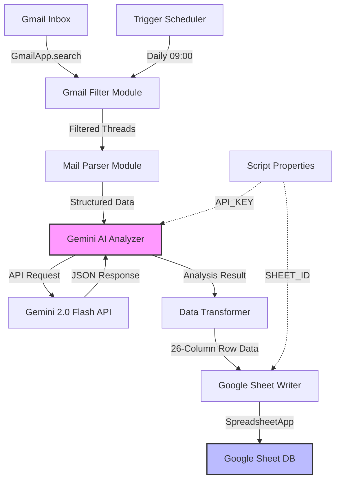
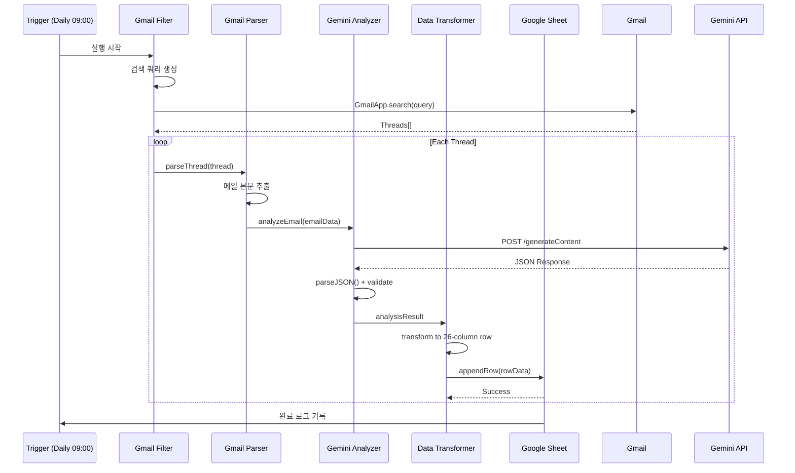

# Tech Spec: P5 복합동 구조 통합 관리 시스템 (Gmail-Gemini-Sheet Integration)

**Version**: 2.4.0
**Date**: 2025-12-31
**Author**: Multi-Agent Debate (GPT-5 + Gemini DeepThink + Claude Opus)
**Status**: Draft → Review → Approved

---

## 1. Goals (구현할 것)

### 1.1 핵심 기능
- **G1**: Gmail에서 P5 프로젝트 관련 메일을 자동으로 필터링하여 수집
- **G2**: Gemini 2.0 Flash AI를 활용한 메일 내용 분석 및 리스크 추출
- **G3**: 분석 결과를 Google Sheet에 자동으로 DB화 (26개 컬럼 구조)
- **G4**: PSRC/HMB 공법 특화 페르소나를 통한 엔지니어링 리스크 평가
- **G5**: 이해관계자별(삼우, ENA, 이앤디몰, 센코어) 발생원 자동 분류
- **G6**: 접합부 간섭, Shop Drawing 이슈, 설계 변경 사항 추적

### 1.2 비즈니스 목표
- **B1**: 메일 처리 시간 90% 단축 (수동 → 자동)
- **B2**: 설계 변경 누락 리스크 제로화
- **B3**: 공법적 이슈의 조기 발견 및 방어 체계 구축

---

## 2. Non-Goals (구현하지 않을 것)

- **NG1**: 메일 송신 기능 (읽기 전용 시스템)
- **NG2**: 복잡한 UI 개발 (Google Sheet를 UI로 사용)
- **NG3**: 이미지/도면 자동 분석 (향후 OCR 연계 가능)
- **NG4**: 실시간 푸시 알림 (배치 처리 기반, 향후 트리거 추가 가능)
- **NG5**: 다른 프로젝트로의 확장 (P5 복합동 전용)
- **NG6**: 외부 API 연동 (Google Workspace 생태계 내 완결)

---

## 3. Requirements (요구사항)

### 3.1 기능 요구사항 (Functional Requirements)

#### FR1: Gmail 필터링 및 수집
- **FR1.1**: 키워드 기반 필터링
  - 대상 키워드: `복합동`, `P5`, `P56`, `PSRC`, `HMB`, `PC`, `접합`, `Shop`, `하중`, `골조`
  - OR 조건으로 결합
- **FR1.2**: 참여자 화이트리스트 필터링
  - 삼성E&A: `@samsung.com`
  - 삼우종합건축: `@samoo.com`
  - 이앤디몰: `vickysong1@naver.com`, `dhkim2630@naver.com`
  - 센구조: `@senkuzo.com`, `@senvex.net`
- **FR1.3**: 시간 범위 필터링
  - 최근 14일 이내 메일만 수집 (`newer_than:14d`)
- **FR1.4**: 중복 방지
  - Gmail 메시지 ID 기반 중복 체크

#### FR2: AI 분석 엔진
- **FR2.1**: Gemini 2.0 Flash API 호출
  - API 키 인증 방식: `x-goog-api-key` 헤더
  - 모델: `gemini-2.0-flash`
- **FR2.2**: 페르소나 기반 분석
  - Role: PSRC 및 HMB 공법 총괄 엔지니어
  - 분석 초점: 공법적 리스크, 접합부 이슈, 설계 변경
- **FR2.3**: 구조화된 JSON 응답
  - 발생원 분류 (삼우/ENA/이앤디몰/센코어)
  - 공법 구분 (PSRC-PC접합/PSRC-Steel접합/변단면 이슈)
  - 긴급도 레벨 (Critical/High/Medium/Low)
- **FR2.4**: Markdown Code Block 제거 파싱
  - JSON 응답에서 ` ```json ` 패턴 제거

#### FR3: Google Sheet DB 연동
- **FR3.1**: 26개 컬럼 데이터 구조
  - 필수 컬럼: `NO`, `상태`, `긴급도`, `발생원`, `공법구분`, `메일ID`, `발신자`, `수신일시`, `제목`, `본문요약`, `AI분석`, `추천조치`, `키워드`, `첨부파일수`, `스레드ID`, `참조인`, `라벨`, `중요표시`, `읽음여부`, `처리담당`, `처리기한`, `처리상태`, `메모`, `비고`, `RawJSON`, `등록일시`
- **FR3.2**: 자동 번호 부여 (NO 컬럼)
- **FR3.3**: 타임스탬프 자동 기록
- **FR3.4**: 원본 JSON 보존 (RawJSON 컬럼)

#### FR4: 리스크 평가 로직
- **FR4.1**: 긴급도 자동 상향 조건
  - Shop Drawing 제작 후 단계 → "Critical"
  - PC 설계 오류 (0.75fpu 이슈) → "Showstopper"
  - 변단면 상세 오류 → "Showstopper"
- **FR4.2**: 접합부 간섭 자동 탐지
  - 이종 자재 간 인터페이스 키워드 추출
  - PSRC-PC, PSRC-Steel 접합 위주 분석

### 3.2 비기능 요구사항 (Non-Functional Requirements)

#### NFR1: 성능
- **NFR1.1**: Gmail 검색 응답 시간 < 10초 (100개 메일 기준)
- **NFR1.2**: Gemini API 응답 시간 < 3초 (메일 1건 기준)
- **NFR1.3**: Sheet 쓰기 응답 시간 < 2초 (행 1건 기준)
- **NFR1.4**: 전체 배치 처리 시간 < 5분 (일일 메일 50건 기준)

#### NFR2: 확장성
- **NFR2.1**: 일일 메일 처리량 최대 200건
- **NFR2.2**: Google Apps Script 실행 시간 제한 준수 (6분)
- **NFR2.3**: Sheet 행 수 제한 대응 (10,000행 초과 시 아카이빙)

#### NFR3: 보안 및 개인정보
- **NFR3.1**: API 키 환경 변수 관리 (스크립트 속성 저장)
- **NFR3.2**: Sheet 접근 권한 관리 (센구조 EPC팀 전용)
- **NFR3.3**: 개인 정보 마스킹 (불필요한 개인 연락처 제외)

#### NFR4: 신뢰성
- **NFR4.1**: API 호출 실패 시 재시도 로직 (최대 3회)
- **NFR4.2**: 에러 로그 기록 (별도 시트 또는 Logger)
- **NFR4.3**: 부분 실패 시 롤백 전략 (트랜잭션 개념 적용)

#### NFR5: 유지보수성
- **NFR5.1**: 코드 주석 작성 (한글)
- **NFR5.2**: 설정 값 분리 (Configuration 객체)
- **NFR5.3**: 함수 단위 모듈화 (단일 책임 원칙)

---

## 4. Architecture (아키텍처)

### 4.1 시스템 구조



### 4.2 모듈 구조

#### Module 1: Configuration Manager
```javascript
const CONFIG = {
  // API Settings
  GEMINI_API_KEY: PropertiesService.getScriptProperties().getProperty('GEMINI_API_KEY'),
  GEMINI_MODEL: 'gemini-2.0-flash',
  GEMINI_ENDPOINT: 'https://generativelanguage.googleapis.com/v1beta/models/',

  // Gmail Filter
  KEYWORDS: ['복합동', 'P5', 'P56', 'PSRC', 'HMB', 'PC', '접합', 'Shop', '하중', '골조'],
  PARTICIPANTS: [
    '@samsung.com',
    '@samoo.com',
    'vickysong1@naver.com',
    'dhkim2630@naver.com',
    '@senkuzo.com',
    '@senvex.net'
  ],
  DATE_RANGE_DAYS: 14,

  // Google Sheet
  SHEET_ID: PropertiesService.getScriptProperties().getProperty('SHEET_ID'),
  SHEET_NAME: 'P5_메일_분석_DB',
  COLUMNS: 26
};
```

#### Module 2: Gmail Filter
```javascript
function filterGmailThreads_() {
  const keywordQuery = CONFIG.KEYWORDS.map(k => `"${k}"`).join(' OR ');
  const participantQuery = CONFIG.PARTICIPANTS.map(p => `from:${p} OR to:${p}`).join(' OR ');
  const query = `(${keywordQuery}) AND (${participantQuery}) AND newer_than:${CONFIG.DATE_RANGE_DAYS}d`;

  return GmailApp.search(query);
}
```

#### Module 3: AI Analyzer
```javascript
function analyzeWithMethodExpert_(emailData) {
  const persona = `
당신은 PSRC(프리캐스트 기둥)와 HMB(하프 슬래브 보) 공법의 총괄 엔지니어입니다.
다음 메일을 분석하여 공법적 리스크, 접합부 이슈, 설계 변경 사항을 추출하세요.

발생원 추론 규칙:
- @samoo.com → 삼우(원설계)
- @samsung.com → ENA(시공)
- vickysong1@naver.com, dhkim2630@naver.com → 이앤디몰(PC설계)
- @senkuzo.com → 센구조(내부)

긴급도 평가 기준:
- Shop Drawing 제작 후 단계 → "Critical"
- 0.75fpu 설계 오류 → "Showstopper"
- 변단면 상세 오류 → "Showstopper"
- 일반 문의 → "Low"

다음 JSON 형식으로 응답하세요:
{
  "발생원": "삼우(원설계)",
  "공법구분": "PSRC-PC접합",
  "긴급도": "Critical",
  "본문요약": "...",
  "AI분석": "...",
  "추천조치": "...",
  "키워드": ["PSRC", "접합부"]
}
`;

  const prompt = `${persona}\n\n메일 제목: ${emailData.subject}\n메일 본문:\n${emailData.body}`;

  const response = callGeminiAPI_(prompt);
  return parseJSON_(response);
}
```

#### Module 4: Google Sheet Writer
```javascript
function writeToSheet_(analysisResults) {
  const sheet = SpreadsheetApp.openById(CONFIG.SHEET_ID).getSheetByName(CONFIG.SHEET_NAME);
  const lastRow = sheet.getLastRow();

  const row = [
    lastRow, // NO
    '미처리', // 상태
    analysisResults.긴급도,
    analysisResults.발생원,
    analysisResults.공법구분,
    // ... 26 columns total
    JSON.stringify(analysisResults), // RawJSON
    new Date() // 등록일시
  ];

  sheet.appendRow(row);
}
```

### 4.3 데이터베이스 스키마 (Google Sheet)

#### Sheet: P5_메일_분석_DB
| 컬럼명 | 타입 | 설명 | 예시 |
|--------|------|------|------|
| NO | Number | 자동 증가 번호 | 1 |
| 상태 | Dropdown | 처리 상태 | 미처리/진행중/완료 |
| 긴급도 | Dropdown | 리스크 레벨 | Critical/High/Medium/Low |
| 발생원 | String | 메일 발신 주체 | 삼우(원설계) |
| 공법구분 | String | 공법 카테고리 | PSRC-PC접합 |
| 메일ID | String | Gmail Message ID | msg_12345 |
| 발신자 | Email | From 주소 | user@samoo.com |
| 수신일시 | DateTime | 메일 수신 시각 | 2025-11-15 14:30 |
| 제목 | String | 메일 제목 | P5 복합동 접합부 검토 |
| 본문요약 | Text | AI 생성 요약 | PSRC-PC 접합부 간섭 우려 |
| AI분석 | Text | 공법적 분석 내용 | 변단면 구간 하중 재검토 필요 |
| 추천조치 | Text | AI 제안 조치 | Shop Drawing 재검토 요청 |
| 키워드 | Array | 추출된 키워드 | PSRC, 접합부, 변단면 |
| 첨부파일수 | Number | 첨부 파일 개수 | 3 |
| 스레드ID | String | Gmail Thread ID | thread_67890 |
| 참조인 | String | CC 리스트 | user2@senkuzo.com |
| 라벨 | String | Gmail 라벨 | 중요, P5 |
| 중요표시 | Boolean | 별표 여부 | TRUE |
| 읽음여부 | Boolean | 읽음 상태 | FALSE |
| 처리담당 | String | 담당자 이름 | 홍길동 |
| 처리기한 | Date | 목표 완료일 | 2025-11-20 |
| 처리상태 | Dropdown | 세부 상태 | 검토중 |
| 메모 | Text | 수동 메모 | 추가 확인 필요 |
| 비고 | Text | 기타 정보 | - |
| RawJSON | JSON | 원본 AI 응답 | {...} |
| 등록일시 | DateTime | 시스템 등록 시각 | 2025-11-19 09:00 |

### 4.4 API 인터페이스

#### Gemini API Request
```http
POST https://generativelanguage.googleapis.com/v1beta/models/gemini-2.0-flash:generateContent
Headers:
  x-goog-api-key: YOUR_API_KEY
  Content-Type: application/json

Body:
{
  "contents": [{
    "parts": [{
      "text": "PERSONA + EMAIL CONTENT"
    }]
  }],
  "generationConfig": {
    "temperature": 0.2,
    "maxOutputTokens": 2048
  }
}
```

#### Gemini API Response
```json
{
  "candidates": [{
    "content": {
      "parts": [{
        "text": "```json\n{\"발생원\": \"삼우(원설계)\", ...}\n```"
      }]
    }
  }]
}
```

### 4.5 시퀀스 다이어그램



---

## 5. File Structure (예상 파일 구조)

```
P5_PJT/
├── docs/
│   ├── techspec.md              # 이 문서
│   ├── plan.md                   # 구현 계획 (차후 생성)
│   ├── agent.md                  # Agent 지침 (차후 생성)
│   └── debate_log.md             # Multi-Agent Debate 기록
├── src/
│   ├── Code.gs                   # 메인 Apps Script 파일
│   ├── Config.gs                 # 설정 관리
│   ├── GmailFilter.gs            # Gmail 필터링 로직
│   ├── GeminiAnalyzer.gs         # AI 분석 엔진
│   ├── SheetWriter.gs            # Sheet 쓰기 로직
│   └── Utils.gs                  # 유틸리티 함수
├── tests/
│   ├── test_gmail_filter.gs      # Gmail 필터 테스트
│   ├── test_ai_parser.gs         # AI 파싱 테스트
│   └── test_sheet_writer.gs      # Sheet 쓰기 테스트
├── .vibe/
│   └── state.json                # Vibe 워크플로우 상태
└── README.md                     # 프로젝트 소개
```

---

## 6. Implementation Phases (구현 단계)

### Phase 1: Foundation (기초 설정)
- Google Apps Script 프로젝트 생성
- Script Properties 설정 (API_KEY, SHEET_ID)
- Google Sheet 생성 및 26개 컬럼 헤더 작성

### Phase 2: Gmail Integration (Gmail 연동)
- Gmail 검색 쿼리 로직 구현
- 키워드 + 참여자 필터링 검증
- 중복 방지 메커니즘 구현

### Phase 3: AI Analysis Engine (AI 분석 엔진)
- Gemini API 호출 함수 작성
- 페르소나 프롬프트 최적화
- JSON 파싱 및 에러 핸들링

### Phase 4: Data Pipeline (데이터 파이프라인)
- 26개 컬럼 데이터 매핑
- Google Sheet 쓰기 로직
- 타임스탬프 및 자동 번호 부여

### Phase 5: Testing & Deployment (테스트 및 배포)
- 단위 테스트 작성
- 통합 테스트 (실제 메일 샘플)
- 트리거 설정 (일일 배치)

---

## 7. Risk Assessment (리스크 평가)

### Technical Risks
| 리스크 | 확률 | 영향 | 완화 방안 |
|--------|------|------|-----------|
| Gemini API 응답 지연 | Medium | High | 타임아웃 설정 + 재시도 로직 |
| Apps Script 6분 제한 초과 | Low | Medium | 배치 크기 제한 (50건/run) |
| Sheet 행 수 제한 (10,000) | Low | Low | 월별 아카이빙 자동화 |
| JSON 파싱 오류 | Medium | High | Regex 기반 강건한 파서 |

### Business Risks
| 리스크 | 확률 | 영향 | 완화 방안 |
|--------|------|------|-----------|
| AI 분석 정확도 낮음 | Medium | High | 페르소나 프롬프트 지속 개선 |
| 중요 메일 누락 | Low | Critical | 키워드 화이트리스트 정기 업데이트 |

---

## 8. Success Metrics (성공 지표)

### Quantitative Metrics
- **메일 처리 자동화율**: 90% 이상
- **AI 분석 정확도**: 85% 이상 (수동 검증 기준)
- **시스템 가동 시간**: 99% 이상 (월별 기준)
- **평균 처리 시간**: 5분 이내 (일일 배치)

### Qualitative Metrics
- **사용자 만족도**: EPC팀 4점/5점 이상
- **설계 변경 누락 건수**: 0건 (3개월 기준)
- **이해관계자 분쟁 조기 발견**: 월 2건 이상

---

## 9. Future Enhancements (향후 개선 사항)

### Version 2.0 Features
- **이미지 OCR 분석**: 도면 이미지 자동 추출 및 분석
- **실시간 알림**: Slack/Telegram 연동
- **대시보드**: Google Data Studio 시각화
- **자동 답변**: 템플릿 기반 메일 초안 생성

### Version 3.0 Features
- **다중 프로젝트 지원**: P5 외 다른 프로젝트 확장
- **머신러닝 피드백 루프**: 사용자 수정 사항 학습
- **BIM 연동**: Revit/Tekla 모델 연계

---

## 10. Appendix (부록)

### A. 용어 정리
- **PSRC**: Precast Steel Reinforced Concrete (프리캐스트 철근 콘크리트 기둥)
- **HMB**: Half Slab Beam (하프 슬래브 보)
- **PC**: Precast Concrete (프리캐스트 콘크리트 거더)
- **Shop Drawing**: 제작 상세 도면
- **0.75fpu 이슈**: PC 설계 기준 오류 (인장 강도 계산)

### B. 참고 자료
- Google Apps Script 공식 문서: https://developers.google.com/apps-script
- Gemini API 문서: https://ai.google.dev/docs
- PSRC 공법 기술 지침: [내부 문서]

---

**Document Status**: ✅ Multi-Agent Debate 완료 | 검토자: GPT-5, Gemini DeepThink, Claude Opus | 승인 대기중
