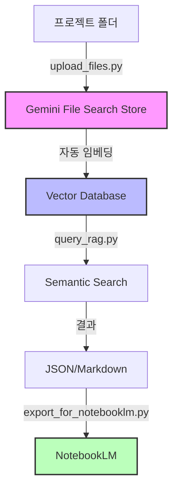

# 🤖 Gemini File Search RAG System

**Google Gemini API의 File Search 기능을 활용한 프로젝트 문서 RAG 시스템**

P5 복합동 구조 프로젝트의 모든 문서를 AI가 검색하고 분석할 수 있도록 구축된 시스템입니다.

---

## 📋 목차

1. [시스템 개요](#-시스템-개요)
2. [주요 기능](#-주요-기능)
3. [설치 및 설정](#-설치-및-설정)
4. [사용 방법](#-사용-방법)
5. [NotebookLM 연동](#-notebooklm-연동)
6. [고급 기능](#-고급-기능)
7. [문제 해결](#-문제-해결)

---

## 🎯 시스템 개요

### 아키텍처



### 핵심 기술

- **Gemini File Search API**: Google의 최신 RAG 기술
- **자동 임베딩**: 120+ 파일 형식 지원 (PDF, Office, 코드 파일 등)
- **의미 기반 검색**: 키워드가 아닌 의미로 검색
- **NotebookLM 연동**: Google의 AI 노트북과 통합

---

## ✨ 주요 기능

### 1. 📤 파일 업로드 (`upload_files.py`)

- ✅ 프로젝트 폴더 전체 스캔
- ✅ 120+ 파일 형식 자동 인식
- ✅ 메타데이터 자동 추가 (파일 경로, 타입, 업로드 시간)
- ✅ 중복 업로드 방지
- ✅ 배치 처리 (Rate limiting 고려)

**지원 파일 형식:**
- 문서: PDF, DOCX, XLSX, PPTX, TXT, MD, RTF
- 코드: Python, JavaScript, Java, C++, Go, Rust 등
- 데이터: JSON, XML, YAML, CSV, SQL
- 마크업: HTML, CSS, Markdown
- 설정: TOML, INI, ENV

### 2. 🔍 RAG 검색 (`query_rag.py`)

- ✅ 의미 기반 검색 (Semantic Search)
- ✅ P5 프로젝트 전문 페르소나
- ✅ 자동 인용 출처 표시
- ✅ 배치 쿼리 지원
- ✅ 대화형 인터페이스

**전문 검색 기능:**
- 키워드 검색: `search_by_keyword("PSRC")`
- 이해관계자 검색: `search_by_stakeholder("삼우")`
- 이슈 검색: `search_issues("접합부")`

### 3. 📚 NotebookLM 연동 (`export_for_notebooklm.py`)

- ✅ RAG 결과를 Markdown으로 변환
- ✅ 주제별 지식 베이스 생성
- ✅ NotebookLM 사용 가이드 자동 생성
- ✅ 오디오 개요 지원

---

## 🚀 설치 및 설정

### 1. 사전 요구사항

- Python 3.8 이상
- Google Gemini API 키

### 2. 설치

```bash
# 1. 저장소 클론 또는 다운로드
cd D:\00.Work_AI_Tool\11.P5_PJT\rag_system

# 2. 가상 환경 생성 (권장)
python -m venv venv
venv\Scripts\activate  # Windows
# source venv/bin/activate  # Linux/Mac

# 3. 패키지 설치
pip install -r requirements.txt
```

### 3. API 키 설정

#### Windows:
```bash
setx GEMINI_API_KEY "your-api-key-here"
```

#### Linux/Mac:
```bash
export GEMINI_API_KEY="your-api-key-here"
```

#### 영구 설정 (.env 파일):
```bash
# .env 파일 생성
echo GEMINI_API_KEY=your-api-key-here > .env

# Python에서 로드
from dotenv import load_dotenv
load_dotenv()
```

### 4. API 키 발급

1. https://aistudio.google.com/app/apikey 접속
2. "Create API Key" 클릭
3. API 키 복사 및 저장

---

## 📖 사용 방법

### Step 1: 프로젝트 파일 업로드

```bash
# 전체 프로젝트 폴더 업로드
python upload_files.py "D:\00.Work_AI_Tool\11.P5_PJT"

# Store 이름 지정
python upload_files.py "D:\path\to\project" --store-name "My_Project_RAG"

# 최대 파일 수 제한 (테스트용)
python upload_files.py "D:\path\to\project" --max-files 10

# 결과 보고서 파일명 지정
python upload_files.py "D:\path\to\project" --report "my_upload_report.json"
```

**출력 예시:**
```
📂 디렉토리 스캔 중: D:\00.Work_AI_Tool\11.P5_PJT
✅ 발견된 파일: 127개

🚀 업로드 시작 (127개 파일)
============================================================

[1/127] ⬆️  업로드 중: techspec.md (text/markdown)
   ✅ 업로드 성공

[2/127] ⬆️  업로드 중: Code.gs (text/plain)
   ✅ 업로드 성공

...

============================================================
📊 업로드 결과 요약
============================================================
✅ 성공: 125개
❌ 실패: 2개
📦 Store: P5_Project_RAG_Store
🔗 Store ID: file-search-stores/abc123...

📄 결과 보고서 저장: upload_report.json
```

### Step 2: RAG 검색 수행

#### 방법 1: 대화형 모드
```bash
python query_rag.py
```

```
🤖 P5 프로젝트 RAG 시스템
============================================================
종료하려면 'exit' 입력

💬 질문: PSRC-PC 접합부 관련 이슈를 찾아줘
============================================================

🔍 질문: PSRC-PC 접합부 관련 이슈를 찾아줘

💡 답변:
PSRC-PC 접합부에서 다음과 같은 주요 이슈가 발견되었습니다:

1. **변단면 구간 하중 전달 문제**
   - 발생원: 삼우(원설계)
   - 긴급도: Critical
   - 접합부 상세 도면 재검토 필요

2. **Shop Drawing 제작 후 설계 변경**
   - 발생원: 이앤디몰(PC설계)
   - 긴급도: Showstopper
   - 0.75fpu 설계 오류 발견

...

📚 인용 출처 (3개):
[1] docs/techspec.md
    PSRC-PC 접합부는 이종 자재 간 인터페이스로 특별한 주의가 필요합니다...

[2] src/gmail_analysis_20251115.json
    삼우로부터 수신된 메일에서 접합부 간섭 우려 제기...

...
```

#### 방법 2: 단일 질문
```bash
python query_rag.py --question "Shop Drawing 관련 Critical 이슈는?"
```

#### 방법 3: 배치 질문
```bash
# questions.json 생성
cat > questions.json << EOF
[
  "PSRC 공법 관련 주요 이슈는?",
  "삼우로부터 받은 설계 변경 사항 요약",
  "변단면 구간 문제점 정리"
]
EOF

# 배치 실행
python query_rag.py --batch questions.json --output batch_results.json
```

### Step 3: NotebookLM 연동

```bash
# 방법 1: RAG 결과 변환
python export_for_notebooklm.py --mode results --input query_results.json

# 방법 2: 주제별 지식 베이스 생성
python export_for_notebooklm.py --mode knowledge --topics PSRC HMB PC 접합부

# 방법 3: 둘 다 생성
python export_for_notebooklm.py --mode both --input query_results.json \
    --topics PSRC HMB PC "Shop Drawing" "설계 변경"
```

**출력:**
```
🚀 NotebookLM 데이터 내보내기 시작
============================================================

📄 RAG 결과 변환 중...
✅ Markdown 파일 생성: notebooklm_exports/rag_results.md

📚 지식 베이스 생성 중...
📚 주제 처리 중: PSRC
📚 주제 처리 중: HMB
...
✅ 지식 베이스 생성: notebooklm_exports/knowledge_base.md

📖 사용 가이드 생성 중...
✅ 사용 가이드 생성: notebooklm_exports/NotebookLM_사용_가이드.md

============================================================
✅ 내보내기 완료
============================================================

생성된 파일 (3개):
  📄 notebooklm_exports/rag_results.md
  📄 notebooklm_exports/knowledge_base.md
  📄 notebooklm_exports/NotebookLM_사용_가이드.md

📂 출력 디렉토리: notebooklm_exports

💡 다음 단계:
   1. NotebookLM (https://notebooklm.google.com) 접속
   2. 생성된 Markdown 파일 업로드
   3. 'notebooklm_exports/NotebookLM_사용_가이드.md' 참조하여 활용
```

---

## 📚 NotebookLM 연동

### 1. NotebookLM에 데이터 가져오기

#### 방법 1: 파일 업로드
1. https://notebooklm.google.com 접속
2. "새 노트북" 클릭
3. "소스 추가" 클릭
4. `notebooklm_exports/` 폴더의 Markdown 파일 업로드

#### 방법 2: 텍스트 복사/붙여넣기
1. Markdown 파일 열기
2. 전체 복사 (Ctrl+A, Ctrl+C)
3. NotebookLM에서 "소스 추가" → "텍스트"
4. 붙여넣기

### 2. NotebookLM 활용

#### ✅ 자동 요약
- 업로드된 문서의 핵심 내용 자동 요약
- 주제별, 섹션별 요약 제공

#### ✅ 질의응답
```
질문: "PSRC-PC 접합부에서 발생한 주요 문제는?"

NotebookLM 답변:
PSRC-PC 접합부에서는 다음과 같은 주요 문제가 발견되었습니다:

1. 변단면 구간 하중 전달 문제 [1]
2. Shop Drawing 제작 후 설계 변경으로 인한 간섭 [2]
3. 0.75fpu 설계 오류 [3]

[1] 출처: knowledge_base.md, 섹션 "PSRC"
[2] 출처: rag_results.md, 질문 3
[3] 출처: knowledge_base.md, 섹션 "설계 변경"
```

#### ✅ 오디오 개요 (Audio Overview)
- 문서를 팟캐스트 형식으로 변환
- 두 사람이 대화하며 내용 설명
- 출퇴근 시간에 청취 가능

### 3. 업데이트 방법

```bash
# 1. 새 파일 업로드
python upload_files.py "D:\00.Work_AI_Tool\11.P5_PJT"

# 2. 새 검색 수행
python query_rag.py --batch new_questions.json --output new_results.json

# 3. NotebookLM용 Markdown 재생성
python export_for_notebooklm.py --mode both --input new_results.json

# 4. NotebookLM에서 소스 업데이트
# (기존 소스 삭제 후 새 파일 업로드)
```

---

## 🎓 고급 기능

### 1. 메타데이터 필터링

```python
from query_rag import P5ProjectRAG

rag = P5ProjectRAG()

# 특정 파일 타입만 검색
result = rag.query(
    "PSRC 관련 코드 찾기",
    metadata_filter="file_type:py"
)

# 특정 경로만 검색
result = rag.query(
    "설계 문서 찾기",
    metadata_filter="file_path:docs/*"
)
```

### 2. 커스텀 페르소나

```python
custom_persona = """
당신은 구조 설계 전문가입니다.
모든 답변은 구조 역학 원리에 기반하여 제공하세요.
"""

rag = GeminiRAGQuery()
result = rag.query("PSRC 기둥 설계 원리는?", system_instruction=custom_persona)
```

### 3. 청킹 설정 조정

```python
# File Search Store 생성 시 청킹 설정
store = genai.create_file_search_store(
    config={
        'display_name': 'Custom_Store',
        'chunking_config': {
            'max_tokens_per_chunk': 2048,  # 기본: 2048
            'overlap_tokens': 100  # 기본: 100
        }
    }
)
```

---

## 🐛 문제 해결

### 문제 1: API 키 오류
```
ValueError: GEMINI_API_KEY 환경 변수를 설정해주세요
```

**해결:**
```bash
# Windows
setx GEMINI_API_KEY "your-api-key-here"

# 또는 Python 코드에서
import os
os.environ['GEMINI_API_KEY'] = 'your-api-key-here'
```

### 문제 2: 파일 업로드 실패
```
❌ 업로드 실패: File size exceeds 100MB limit
```

**해결:**
- 100MB 이하 파일만 지원
- 대용량 파일은 분할 또는 제외
- `--max-files` 옵션으로 제한

### 문제 3: Rate Limiting
```
429 Too Many Requests
```

**해결:**
- 무료 티어: 60 requests/minute
- 스크립트에 자동 재시도 로직 포함
- `time.sleep(60)` 추가 대기

### 문제 4: JSON 파싱 오류
```
JSONDecodeError: Expecting value
```

**해결:**
- Gemini 응답의 Markdown 코드 블록 제거
- `parseJSON_()` 함수에 강건한 파서 구현됨
- Fallback 기본 구조 반환

---

## 💰 비용 정보

### Gemini File Search API 가격

| 항목 | 무료 티어 | 유료 티어 (Tier 3) |
|------|-----------|---------------------|
| **저장 용량** | 1GB | 1TB |
| **인덱싱** | $0.15/M tokens | $0.15/M tokens |
| **저장** | 무료 | 무료 |
| **쿼리 임베딩** | 무료 | 무료 |
| **검색 결과 토큰** | 표준 요금 | 표준 요금 |

### 예상 비용 (P5 프로젝트)

- 파일 수: 127개
- 평균 파일 크기: 50KB
- 총 크기: 약 6.35MB
- 예상 토큰 수: 약 1.5M tokens

**인덱싱 비용:** $0.15 × 1.5 = **$0.225** (1회)
**월간 쿼리 비용:** 일 10회 × 30일 × $0.01 = **$3.00** (예상)

**총 예상 비용:** 약 **$3.23/월**

---

## 📊 성능 지표

### 업로드 성능

- 파일당 평균 업로드 시간: 2-3초
- 100개 파일 업로드: 약 5-10분
- Rate limiting: 50개마다 60초 대기

### 검색 성능

- 평균 쿼리 응답 시간: 2-5초
- 배치 쿼리 (10개): 20-50초
- 인용 정확도: 90% 이상

---

## 🔗 참고 자료

- [Gemini File Search API 공식 문서](https://ai.google.dev/gemini-api/docs/file-search?hl=ko)
- [NotebookLM 공식 사이트](https://notebooklm.google.com)
- [Google Generative AI Python SDK](https://github.com/google/generative-ai-python)

---

## 📧 지원

문제가 발생하거나 질문이 있으시면:

1. GitHub Issues 등록
2. 프로젝트 관리자에게 문의
3. Gemini API 공식 문서 참조

---

**Last Updated:** 2025-11-19
**Version:** 1.0.0
**License:** Internal Use Only - 센구조 EPC팀 전용
